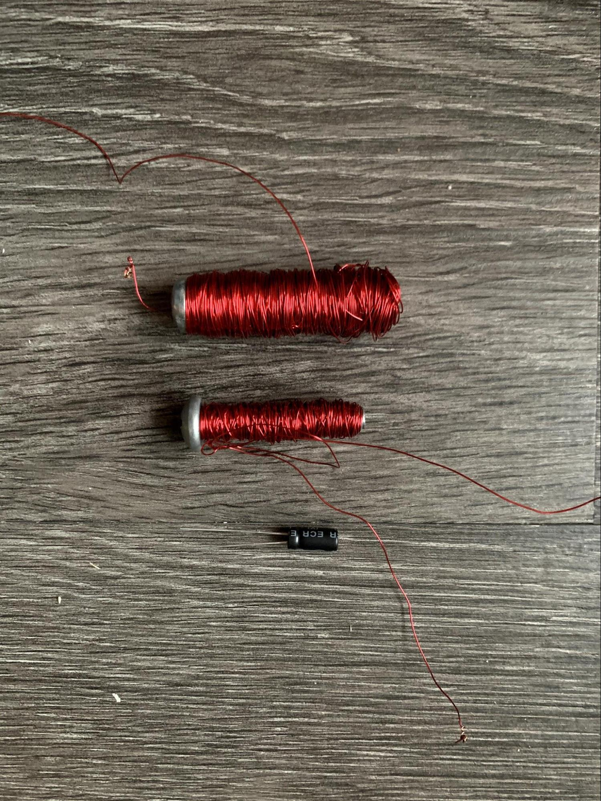
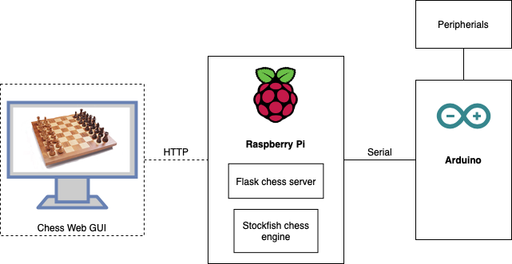

# Square On: The Magic Chess Robot

#### Authors: Baran Usluel, Mark Faingold, Christian Butticaz

#### [Source Code](https://github.com/baranusluel/square-on/tree/main/software)

<iframe width="560" height="315" src="https://www.youtube.com/embed/3NJV737BzyU" frameborder="0" allow="accelerometer; autoplay; clipboard-write; encrypted-media; gyroscope; picture-in-picture" allowfullscreen></iframe>

## Overview

We built an automatic chess-playing robot, inspired by what is as of today [the world’s second smartest chess board - Square Off](https://squareoffnow.com/). It drags pieces with an electromagnet under the board. Players can interface with it through a web UI. It is big.

## Mechanical Hardware 
### X-Y bot
We knew that in our design the pieces must move seemingly on their own. Our solution was to use an X-Y cartesian actuator to move the pieces from underneath the board by using an electromagnet. The standard chess set that we ordered from Amazon was made of wood, so we glued ferrous washers to the bottom of the pieces. 

The most straightforward naive design for a two-axis actuator can suffer from instability due to the uneven belt attachment and the weight of a motor on a moving carriage.

Therefore, we decided to go with a more complex, but significantly more robust [CoreXY design](http://corexy.com/theory.html). This proved to be a good decision down the road as even with our imperfectly manufactured wooden frame, we could achieve highly precise motion. We also had to adjust the control according to the CoreXY design equations:

For the outer frame of the X-Y bot and the Y-carriage, we used a single 4x2 sheet of wood. They were cut out by hand with a jigsaw.

We developed an ad hoc solution for securing the belt system. A set of washers and nuts were used to keep the idlers (rotary ball bearings) at a certain height on machine screws. The larger washers ensured that the belt wouldn’t come off.

We mounted the carriages on smooth rods with standard LM8UU linear bearings. The bearings attached to carriages with zip ties, an easy and surprisingly secure solution. We cut out wooden mounting blocks for securing the smooth rods and hot glued them to the external frame and the Y-carriage. Since most easily accessible smooth rods are intended for use in 3D printers, we struggled to find rods of sufficient length. To compensate, we made the mounting blocks stick out slightly from under the frame. 

After installing the NEMA17 stepper motors and pulleys, we passed around two timing belts, tightened them, and zip tied them to the small X-carriage. 

The X-Y bot construction was complete.

### Chess board
For the chess board we chose to use a transparent sheet of acrylic to showcase the inner mechanism. We used a laser cutter, to engrave the squares on the acrylic. Here it is on top of the other parts.

We chose to make the chess board and robot itself fairly large so that there would be enough space between each chess piece to allow a knight to pass in between.

### The box
We used another 4x2 sheet for the box. The sides were connected with nails and reinforced with hot glue. L-brackets attach the top and bottom of the box as well as hold the frame of the X-Y bot.

We laid cork on the top side of the box to make it beautiful and keep the acrylic board in place. We still wanted the board to be removable for easy access to the electronics inside the box. 

## Electronics
### Overall Architecture

### Electromagnet
Fortunate to have a seasoned electromagnetics student on our team, we learned that one can easily build an electromagnet at home using only a screw and wire. However, after several iterations, we only succeeded in barely picking up a ferrous washer off the table with our weak magnet — not nearly enough to reliably move any chess pieces. Ultimately, we ordered an electromagnet from Amazon. 

### Powering the Pi
Almost all of the components including the Arduino, the electromagnet, and the steppers could be powered with 12 V, and luckily we had a reliable 12V power supply on hand. Raspberry Pi however required 5V. We tried employing a linear voltage regulator, but it only lasted for a short time before overheating. As a temporary solution, we resorted to using a portable phone charger to power the Pi until we get a reliable 12V - 5V voltage converter. 

### Detecting Human Moves
Our original vision included a human player moving their pieces by hand and a robot opponent responding by moving its pieces with an electromagnet. But we faced a grand challenge: How can we know where the human player has put their piece. We considered several approaches: mechanical switches, RFID tags for pieces, ambient light sensors under each square, and computer vision. Computer vision seemed to be the most feasible approach, but it would have required an addition of a structure overlooking the board to get a reliable angle. We wanted to keep the chess board--which was in fact closer to a chess table at this point--self contained, so we opted for a keypad-like matrix of conductive tape. Since each piece had a metal washer on the bottom, it would short the row and column when placed in the center of a square. 

Although sound in theory, this plan did not work out in practice. The pieces failed to make reliable connections with both the row and column tape pieces, so we couldn’t always get an accurate reading of the players position. This forced us to readjust our vision. We pivoted to a web-based interface where the human player can make moves against the machine and see both their moves and the machine’s moves reflected on the physical chessboard. Now, we had no problems obtaining the board state since it was inputted through a web GUI and stored on the server. 

## Software
The human player interacts with the system through a web chess interface which runs on a Python Flask backend hosted on the Raspberry Pi. We leveraged an existing [open source project](https://github.com/baranusluel/flask-chess-platform/) for the chess front end and server, modifying it to send data over Serial to the Arduino. Beside receiving updates from the UI and maintaining the board state, the server also runs a Stockfish 12 engine which means that our chess board can dominate the strongest grandmasters in the world. 

On every move, the Pi sends an updated board state to the Arduino over a serial connection. Our [Arduino controller software](https://github.com/baranusluel/square-on/blob/main/software/arduino-controller/arduino-controller.ino) interprets the new state and decides what pieces need to be physically moved. It then deduces how to move the actuator and activate the electromagnet. It also accounts for the edge cases in the removal of captured pieces, knight movements and diagonal movements (e.g. bishop) ensuring that there are no collisions. 

Although it could be feasible to interface with the peripherals from the Pi directly, we chose to use an Arduino as a broker because the non-RTOS Linux OS running on the Pi could potentially be too slow to pulse the stepper motors at an appropriate and consistent rate. Ensuring the fluid motion of the pieces required precise I/O time requirements of 250 μs. 

## Future work 
- [ ] Sense user moves.  
- [ ] Voice controlled user moves.  
- [ ] Power the pi using a switching voltage regulator.  
- [ ] Transfer the electronics to a PCB.

## Components List

| Item | Quantity |
|------|----------|
| 1/4 in. x 2 ft. x 4 ft. Plywood | 3 |
| 0.093 in. x 18 in. x 24. in Clear Acrylic Sheet | 1 |
| NEMA17 Stepper Motor | 2 |
| Pololu A4998 Stepper Driver | 2 |
| GT2 Timing Belt 6mm x 5 meters | 1 |
| 20 Teeth 8mm Bore Belt Pulley | 2 |
| 608 Ball Bearing | 8 |
| LM8UU Linear Bearing | 5 |
| 8mm x 6m Hardened Chrome Smooth Rod | 2 |
| 8mm x 5m Hardened Chrome Smooth Rod | 2 |
| Mechanical Endstop Limit Switch | 2 |
| Wooden Chess Piece Set | 1 |
| uxcell 12VDC 200N Electromagnet | 1 |
| 5V Relay for 220V 5A | 1 |
| Raspberry Pi 2 Model B | 1 |
| USB Wifi Dongle | 1 |
| Arduino Uno | 1 |
| Breadboard | 1 |
| AC 110V/220V to DC 12V 360W Power Supply | 1 |
| L Bracket | 16 |
| 18 in. x 4 ft. Adhesive Cork Liner | 1 |
| M3 bolt / nut / washer fasteners | X |
| M8 bolt / nut / washer fasteners | X |
